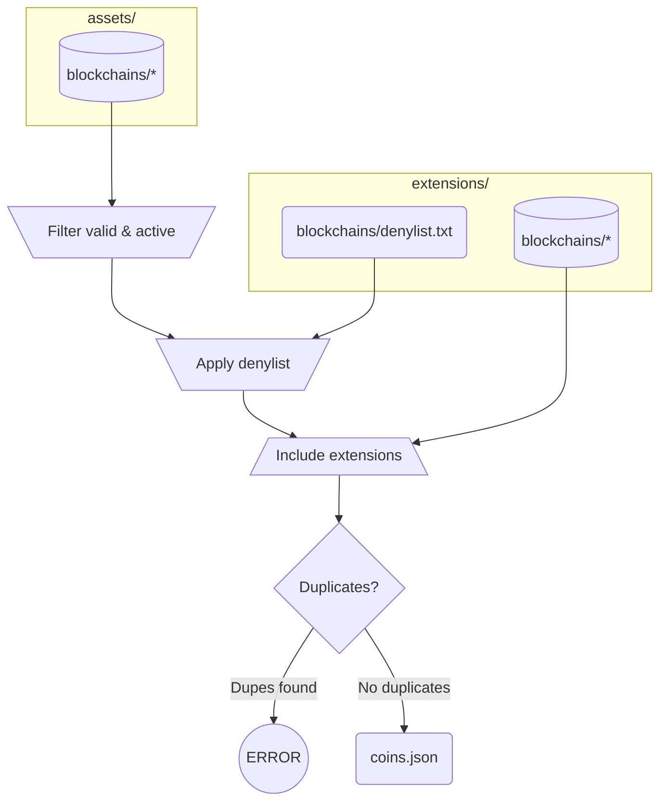
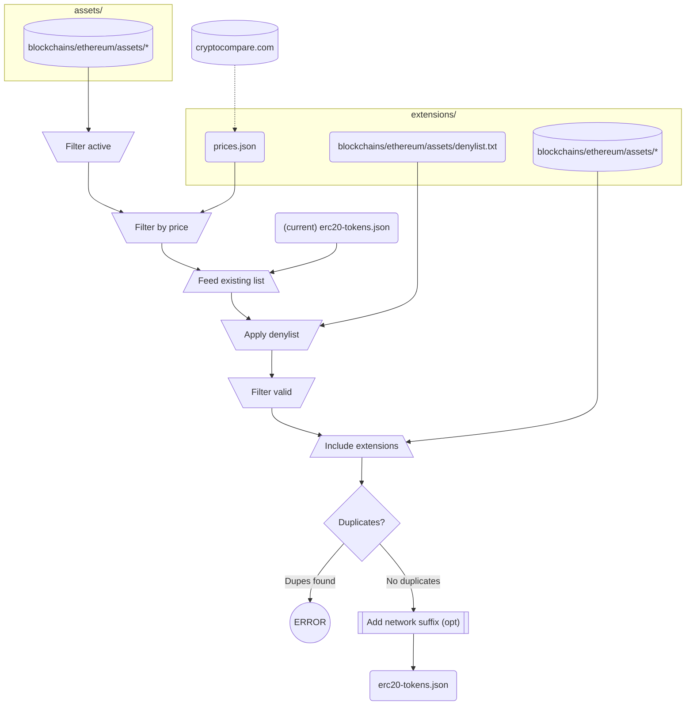

# Blockchain.com Coins Definitions

## Contents

### L1 Coins

All known L1 coins are described in the auto-generated file `coins.json`. Each entry contains:

 - symbol: string
 - name: string
 - key: string
 - decimals: int
 - logo: string
 - website: string

This is the full series of steps to generate it:



Each "extension" contains the chain description and/or logo. If no description or logo is given, the original one is used.

Example: 

```json
  {
    "symbol": "BTC",
    "name": "Bitcoin",
    "decimals": 8,
    "logo": "https://raw.githubusercontent.com/trustwallet/assets/master/blockchains/bitcoin/info/logo.png"
  }
```

### ERC-20 Tokens List

The auto-generated file `erc20-tokens.json` is a single JSON file that contains the info from each asset listed in https://github.com/trustwallet/assets/tree/master/blockchains/ethereum/assets/, filtered and augmented according to the following steps:



As is the case for L1 coins, each "extension" contains the token description and/or logo. If no description or logo is given, the original one is used.

For each asset, we include:

 - address: string
 - decimals: int
 - displaySymbol: string
 - logo: string
 - name: string
 - symbol: string
 - website: string

Example:

```json
{
    "address": "0xdAC17F958D2ee523a2206206994597C13D831ec7",
    "decimals": 6,
    "displaySymbol": "USDT",
    "logo": "https://raw.githubusercontent.com/trustwallet/assets/master/blockchains/ethereum/assets/0xdAC17F958D2ee523a2206206994597C13D831ec7/logo.png",
    "name": "Tether",
    "symbol": "USDT",
    "website": "https://tether.to"
}
```

### Tokens in other chains

On top of the Ethereum ERC20s that live in `erc20-tokens.json`, we also include tokens for Polygon, Binance and Tron. In every case, the final file is generated according to the rules described in "ERC-20 Tokens List", with the appropriate chain in each case:

 - Original assets from `assets/blockchains/<chain>/assets/`
 - Extensions from `extensions/blockchains/<chain>/assets/`
 - Denylist from `extensions/blockchains/<chain>/denylist.txt`

Final lists are generated here:

 - ETH: `erc20-tokens.json`
 - MATIC: `chain/polygon/tokens.json`
 - BNB: `chain/binance/tokens.json`
 - TRX: `chain/tron/tokens.json`

See how to add new ones [here](#add-a-new-chain-with-child-tokens)

### Custodial assets

The file `custody.json` is a list of manually curated assets, combining both L1 coins and ERC20 tokens. Each entry contains:

 - symbol: string
 - displaySymbol: string
 - type: string ('COIN' or 'ERC20')
 - nabuSettings: object
    - custodialPrecision: int
 - hwsSettings: object (nullable)
    - minConfirmations: int
    - minWithdrawal: int
 - removed: bool (optional)

The `hwsSettings` is optional, it's only set when this particular asset is explicitly supported by the HWS.

Example:
```json
  {
    "symbol": "BTC",
    "displaySymbol": "BTC",
    "type": "COIN",
    "custodialPrecision": 8,
    "hwsSettings": {
      "minConfirmations": 2,
      "minWithdrawal": 5460
    }
  }
```

## How-to

### Rebuild and check the output files

After any change is made, in order to trigger the process described above for both [chains](#l1-coins) and [tokens](#erc-20-tokens-list), we only need to execute:

```
$ bash build.sh
[+] Updating master lists...
Reading blockchains from assets/blockchains/
Reading blockchain extensions from extensions/blockchains/
Writing 38 coins to coins.json
Generating token files for network "ethereum"
Reading ETH assets from assets/blockchains/ethereum/assets/
Reading ETH asset prices from extensions/prices.json
Reading existing assets in erc20-tokens.json
Reading ETH asset extensions from extensions/blockchains/ethereum/assets/
Writing 1544 tokens to erc20-tokens.json
[...]
```

That will re-build the lists, using the existing information (assets, denylists, prices, etc), without cross-checking. To check that the data is consistent, we can execute:

```
$ bash check.sh
[+] Running checks...


-  ⚠️  [BCH, COIN]: minWithdrawal 5460 -> $0.010 not in the $0.01-$10 USD range
-  ⚠️  [BSV, COIN]: No logo
-  ⚠️  [CEUR, CELO_TOKEN]: displayed as: cEUR
-  ⚠️  [CLOUT, COIN]: displayed as: DESO
-  ⚠️  [CLOUT, COIN]: minWithdrawal 2000 -> $0.000 not in the $0.01-$10 USD range
-  ⚠️  [CUSD, CELO_TOKEN]: displayed as: cUSD
-  ⚠️  [DGLD, COIN]: minWithdrawal 5460 -> $0.010 not in the $0.01-$10 USD range
-  ⚠️  [LTC, COIN]: minWithdrawal 5460 -> $0.003 not in the $0.01-$10 USD range
-  ⚠️  [PAX, ERC20]: displayed as: USDP
-  ⚠️  [RENBTC, ERC20]: displayed as: renBTC
```

The check script compares the data in `custody.json` with the data in `coins.json`, and each of the token files, looking for inconsistencies (duplicate symbol, non-existing symbols, wrong precision, wrong number of confirmations, and so on). Minor issues like missing symbols or min withdrawal value out of expected range are flagged as warnings.

This process is executed on each PR to make sure the data is not corrupted.

### Disable undesired chains or tokens

If for some reason we want to remove a chain from `coins.json` or a token from `erc20-tokens.json` (or any of the `chain/*/tokens.json` files), we need to add an entry to the corresponding **denylist**.

For chains, it's in `extensions/blockchains/denylist.txt`. It's actually a JSON file, with a top-level array of objects like this: `{"symbol": "<<symbol>>", "name": "<<name>>"}`. Any chain listed there will be filtered out when loading the chains from `assets/blockchains`.

For tokens, each denylist is located in `extensions/blockchains/<<chain>>/denylist.txt`. In this case, each file is a just a plain text with one address per line. Lines that start with "#" are comments and will be ignored. This is useful to include the context for each addition.

One typical example is when looking for duplicates, the final stage of construction. In case duplicates are found, the script will output:

```
# 'ape' is shared by:
# - https://etherscan.io/token/0x04162AEe1c40cF63747E6BC3A7e84ACEC1Ba2A78 (ApeCash):
0x04162AEe1c40cF63747E6BC3A7e84ACEC1Ba2A78
# - https://etherscan.io/token/0x4d224452801ACEd8B2F0aebE155379bb5D594381 (ApeCoin): https://apecoin.com
# 0x4d224452801ACEd8B2F0aebE155379bb5D594381
```

We can just append that to ETH denylist and uncoment the line with the address `0x04162AEe1c40cF63747E6BC3A7e84ACEC1Ba2A78`, as we only want to have one APE token, the one at `0x4d224452801ACEd8B2F0aebE155379bb5D594381`.

Then, we have to [rebuild and check the output files](#rebuild-and-check-the-output-files)

### Add new tokens

In case we want to include a token that just doesn't exist on trustwallet `assets`, we can add it as an extension. We only have to add the info file and logo in `extensions/blockchains/<<chain>>/assets/<<address>>/info` (please note that the address must be in checksum format). Once we added the info file and logo, we have to [rebuild and check the output files](#rebuild-and-check-the-output-files).

Examples: 

 - [Add support for icETH](https://github.com/blockchain/coin-definitions/pull/96)
 - [Add Origin tokens (OGV, veOGV, WOUSD)](https://github.com/blockchain/coin-definitions/pull/89)
 - [Add support for wstETH](https://github.com/blockchain/coin-definitions/pull/91)
 - [Add EUROC](https://github.com/blockchain/coin-definitions/pull/86)


### Override chain or token info

Similarly to [adding new tokens](#add-new-tokens), to override an existing chain or token info, we have to add the token as an extensions, copying the original `info.json` and updating the relevant fields (of course, decimals for example should remain unchanged). [Rebuild](#rebuild-and-check-the-output-files) the output files afterwards.

Remember, for L1s, add the new file(s) to the corresponding directory (L1 coins are referred to by name)

```
extensions/blockchains/{{blockchain}}/info/info.json
```
For ERC-20s, this is where new logos must be put: 

```
extensions/blockchains/ethereum/assets/{{token_address}}/info.json
```

Examples:

 - [Replace RARE, add RENBTC, update logos](https://github.com/blockchain/coin-definitions/pull/66)
 - [Fix Ethereum Gold name](https://github.com/blockchain/coin-definitions/pull/94)
 - [Override DAI name](https://github.com/blockchain/coin-definitions/pull/38)

### Override chain or token logos

Overriding a logo is identical to [overriding the chain or token info](#override-chain-or-token-info): just add (or replace) the logo in the appropriate extension directory, and [rebuild the output files](#rebuild-and-check-the-output-files) to update the logo URL.

Examples:

 - Chains: [DOT](https://github.com/blockchain/coin-definitions/pull/79), [STX](https://github.com/blockchain/coin-definitions/pull/27) (override logos already existed, we only replaced the files)
 - ERC20s: [LEND](https://github.com/blockchain/coin-definitions/pull/68), [1INCH](https://github.com/blockchain/coin-definitions/pull/45), [WBTC](https://github.com/blockchain/coin-definitions/pull/37)

### Enable new chain/token in custody

Once a new chain or token is added to the HWS, it needs to be declared in the `custody.json` file at the root. See [here](#custodial-assets) for a description. This will be consumed by internal services to include the asset in the list of tradeable ones. If the entry has a `null` `hwsSettings` property, then the internal services will ignore it. In the [rebuild and check process](#rebuild-and-check-the-output-files) the `minConfirmations`, `custodialPrecision`, `symbol` properties will be checked against the corresponding definition according to each entry's `type`.

Examples:

 - [NEAR custodial settings + logo](https://github.com/blockchain/coin-definitions/pull/61) (chain)
 - [APE: Add asset to custody.json](https://github.com/blockchain/coin-definitions/pull/73) (ERC20)

### Add a new chain with child tokens

When adding a new chain with child tokens, we have to:

 - Add a new entry to `chain/list.json`, with the appropiate key and native token
 - Initialize an empty `chain/{{chain}}/tokens.json`
 - Initialize an empty [denylist](#disable-undesired-chains-or-tokens) for this chain
 - Declare the chain in the `ERC20_NETWORKS` array in `build-lists.py`
 - (Optional) add the chain to the [custody file](#enable-new-chaintoken-in-custody)

Examples:

 - [Adding TRX](https://github.com/blockchain/coin-definitions/pull/93)
 - Also: [BNB](https://github.com/blockchain/coin-definitions/pull/84), [MATIC](https://github.com/blockchain/coin-definitions/pull/71) (initial support for multi chain)

### Sync with upstream

To update the definitions, just run `update.sh`:

```
$ bash update.sh
```

This will bring the `assets` submodule up to date, refresh cached prices, [re-build all lists, and check the results](#rebuild-and-check-the-output-files). This can possibly lead to conflicts, in case new chains that conflict with custom ones are added, or new tokens that use already existing symbols are added, or prices change and tokens that were previously ignored are now included. In that case, see how to [disable chains or tokens](#disable-undesired-chains-or-tokens)

