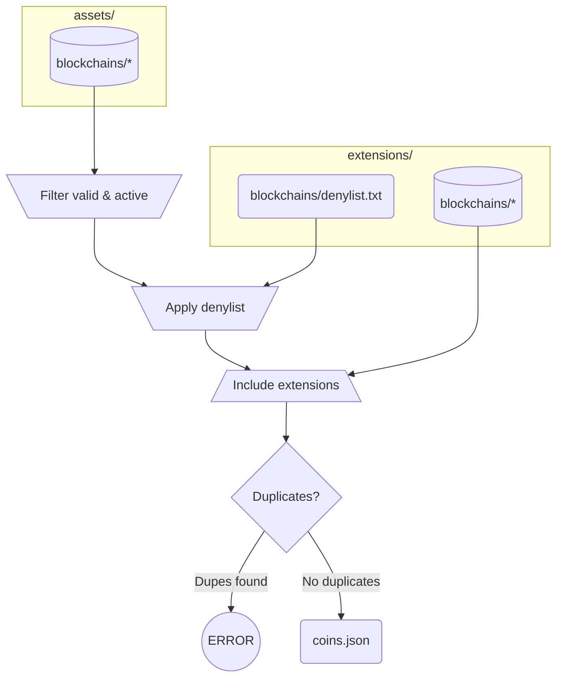
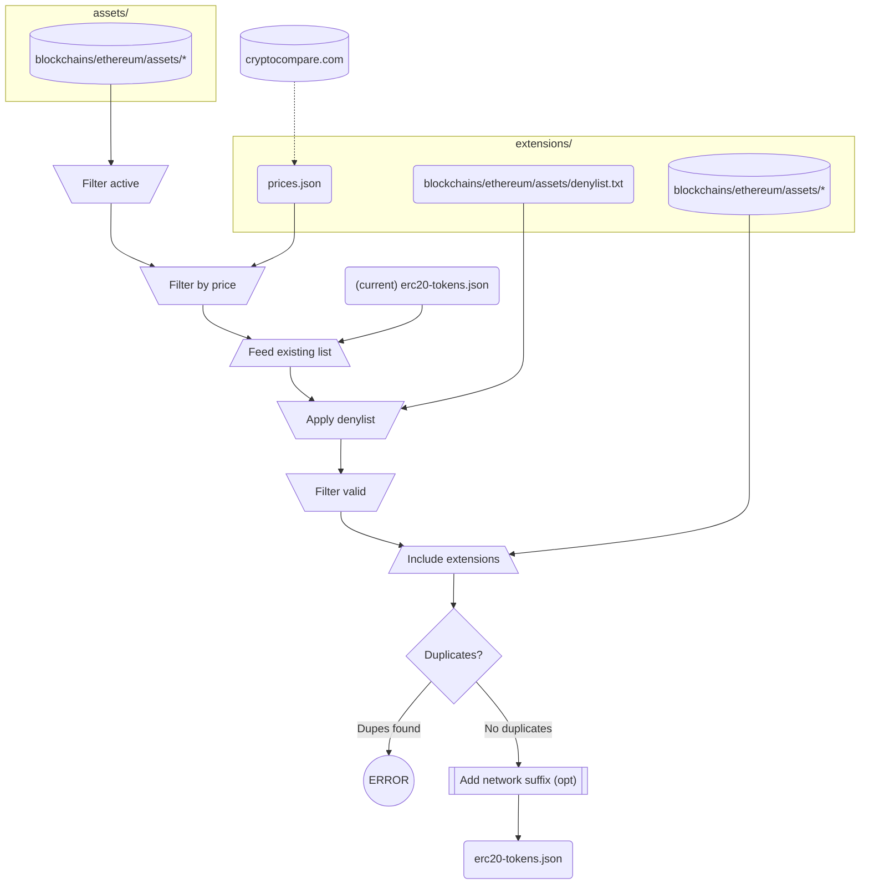

# Blockchain.com Coins Definitions

## Contents

### L1 Coins

All known L1 coins are described in the auto-generated file `coins.json`. Each entry contains:

 - symbol: string
 - name: string
 - key: string
 - decimals: int
 - logo: string
 - website: string

This is how the full series of steps to generate it:



Each "extension" contains the chain description and/or logo. If no description or logo is given, the original one is used.

Example: 

```json
  {
    "symbol": "BTC",
    "name": "Bitcoin",
    "decimals": 8,
    "logo": "https://raw.githubusercontent.com/trustwallet/assets/master/blockchains/bitcoin/info/logo.png"
  }
```

### ERC-20 Tokens List

The auto-generated file `erc20-tokens.json` is a single JSON file that contains the info from each asset listed in https://github.com/trustwallet/assets/tree/master/blockchains/ethereum/assets/, filtered and augmented according to the following steps:



As is the case for L1 coins, each "extension" contains the token description and/or logo. If no description or logo is given, the original one is used.

For each asset, we include:
 - address: string
 - decimals: int
 - displaySymbol: string
 - logo: string
 - name: string
 - symbol: string
 - website: string

Example:

```json
{
    "address": "0xdAC17F958D2ee523a2206206994597C13D831ec7",
    "decimals": 6,
    "displaySymbol": "USDT",
    "logo": "https://raw.githubusercontent.com/trustwallet/assets/master/blockchains/ethereum/assets/0xdAC17F958D2ee523a2206206994597C13D831ec7/logo.png",
    "name": "Tether",
    "symbol": "USDT",
    "website": "https://tether.to"
}
```

### Tokens in other chains

On top of the Ethereum ERC20s that live in `erc20-tokens.json`, we also include tokens for Polygon, Binance and Tron. In every case, the final file is generated according to the rules described in "ERC-20 Tokens List", with the appropriate chain in each case:

 - Original assets from `assets/blockchains/<chain>/assets/`
 - Extensions from `extensions/blockchains/<chain>/assets/`
 - Denylist from `extensions/blockchains/<chain>/denylist.txt`

Final lists are generated here:

 - ETH: `erc20-tokens.json`
 - MATIC: `chain/polygon/tokens.json`
 - BNB: `chain/binance/tokens.json`
 - TRX: `chain/tron/tokens.json`

### Custodial assets

The file `custody.json` is a list of manually curated assets, combining both L1 coins and ERC20 tokens. Each entry contains:

 - symbol: string
 - displaySymbol: string
 - type: string ('COIN' or 'ERC20')
 - nabuSettings: object
    - custodialPrecision: int
 - hwsSettings: object (nullable)
    - minConfirmations: int
    - minWithdrawal: int
 - removed: bool (optional)

The `hwsSettings` is optional, it's only set when this particular asset is explicitly supported by the HWS.

Example:
```json
  {
    "symbol": "BTC",
    "displaySymbol": "BTC",
    "type": "COIN",
    "custodialPrecision": 8,
    "hwsSettings": {
      "minConfirmations": 2,
      "minWithdrawal": 5460
    }
  }
```

## Updating

To update the definitions, just run `update.sh`:

```
$ bash update.sh
```

This will bring the `trustwallet` repo up to date, refresh cached prices, re-build all lists, and check the results. This can possibly lead to conflicts, in case new tokens that use already existing symbols are added, or prices change and tokens that were ignored previously are not anymore.

## Overriding logos:

For L1s, add the new file(s) to the corresponding directory (L1 coins are referred to by name)

```
extensions/blockchains/{{blockchain}}/info/logo.png
```

For ERC-20s, this is where new logos must be put: (NOTE: the address must be in checksum format)

```
extensions/blockchains/ethereum/assets/{{token_address}}/logo.png
```

_For example:_

```
extensions/blockchains/ethereum/assets/0x123151402076fc819B7564510989e475c9cD93CA/logo.png
```

Then run `build.sh` at the root:

```
$ bash build.sh
```

This will re-generate both `coins.json` and `erc20-tokens.json`.
